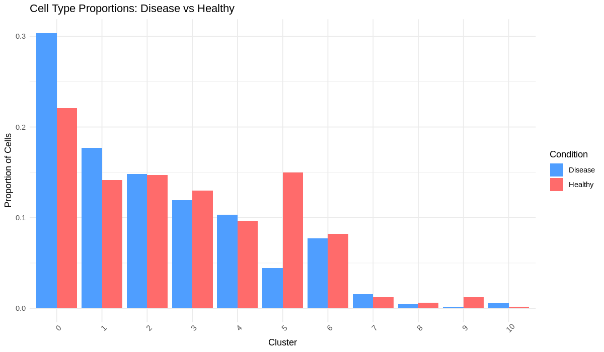
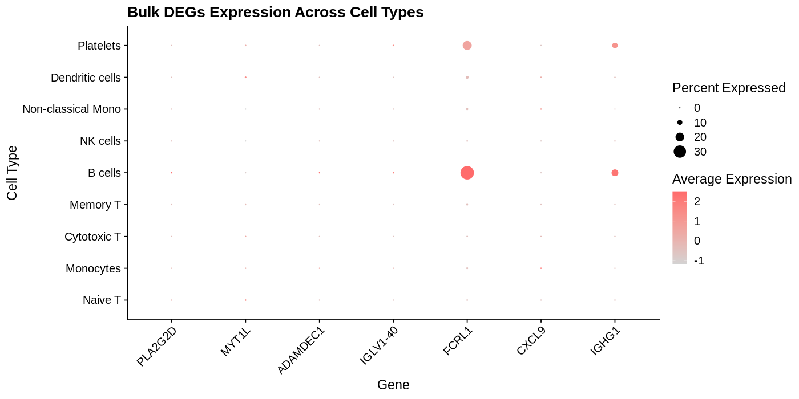

# scRNA-seq Pipeline: PBMC Cell Type Annotation

Single-cell RNA-seq analysis of 2,700 human PBMCs using Seurat.

## Results

### Annotated UMAP — 9 Cell Types Identified

9 distinct cell populations identified:
Naive T cells, Memory T cells, Cytotoxic T cells,
B cells, NK cells, Monocytes, Myeloid cells,
Dendritic cells, Platelets

## Pipeline
- Quality control and filtering (2,700 → 2,638 cells)
- Normalization and scaling
- PCA dimensionality reduction (10 PCs)
- Graph-based clustering (resolution 0.5)
- UMAP visualization
- Marker gene identification
- Cell type annotation

## Tools
R, Seurat, ggplot2, dplyr, Ubuntu, Git

## Exercise 1: Multi-Sample Integration

### The Problem — Batch Effect

> Two donors completely separated by technical variation
> not biological differences.

### The Solution — Harmony Integration  

> Donors now mixed within each cluster.
> Biological signal visible.

### Final Annotated UMAP — 9 Cell Types

> Cell types identified: Naive T, Memory T, Cytotoxic T,
> NK cells, B cells, Monocytes, Non-classical Monocytes,
> Dendritic cells, Platelets.
> Unknown cluster resolved as Naive T cells via
> CCR7 and LEF1 marker analysis.

## Key Skills Learned
- Batch effect detection and correction (Harmony)
- Multi-sample integration (Seurat v5 JoinLayers)
- Unknown cluster investigation
- Cross-dataset marker variability
## Exercise 2: Disease vs Healthy Comparison

### Key Finding — Differential Abundance

Cluster 5 depleted in Disease (15% → 4%):
Ribosomal proteins + LTB markers suggest
Naive/Memory T cells — lymphopenia pattern

Cluster 0 expanded in Disease (22% → 30%):
Dominant cell population increases

## Key Skills Learned
- Dataset-specific QC thresholds (v2 vs v3 chemistry)
- Differential abundance analysis
- Cell proportion comparison between conditions
- Interpreting lymphopenia-like patterns
**Note:** Both datasets are healthy PBMC samples
used to practice the differential abundance workflow.
Real disease comparison requires controlled-access
COVID-19 datasets. Workflow is identical for
real disease data.

## Exercise 3: Bulk-to-Single Cell Integration

### Approach
Cross-referenced breast cancer bulk RNA-seq DEGs
against PBMC scRNA-seq cell type expression.

### Key Finding

FCRL1 and IGHG1 specifically expressed in B cells.
CXCL9 absent in resting PBMC — requires activated
macrophages present only in tumor microenvironment.
CXCL13 absent — confirms tumor-specific exhausted
T cell origin, not circulating blood T cells.

### Biological Conclusion
Breast cancer tumors show B cell infiltration
(FCRL1, IGHG1, IGHV3-43) and exhausted T cell
signatures (CXCL13) — characteristic of
immunologically hot tumors responsive to
checkpoint inhibitor therapy.

## Skills Learned
- Bulk deconvolution concept
- DotPlot visualization across cell types
- Connecting bulk and single cell analyses
- Identifying cell-type-specific gene expression

**Limitation:** This analysis uses healthy PBMC
scRNA-seq as a reference. A complete TME analysis
requires breast cancer tumor scRNA-seq data.
The methodology demonstrated here is identical
to what would be applied to real tumor data.
Real TME analysis planned when GCP access
is available for larger dataset processing.
