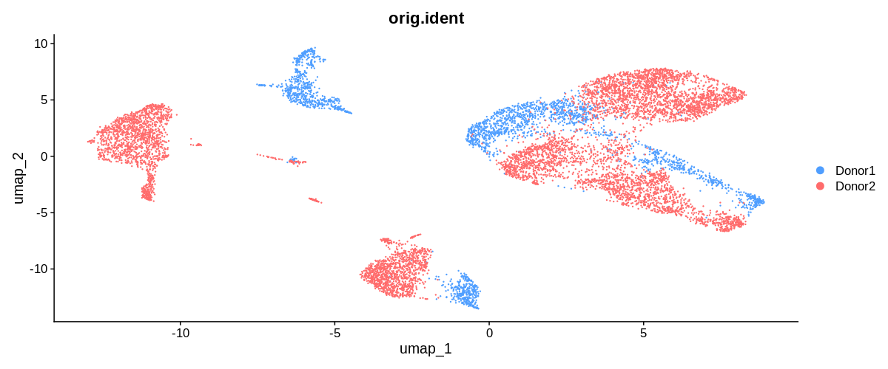
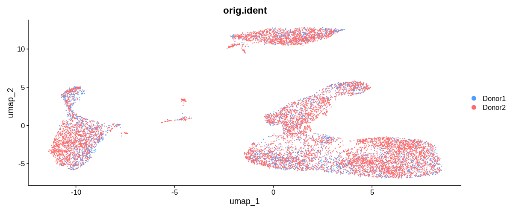
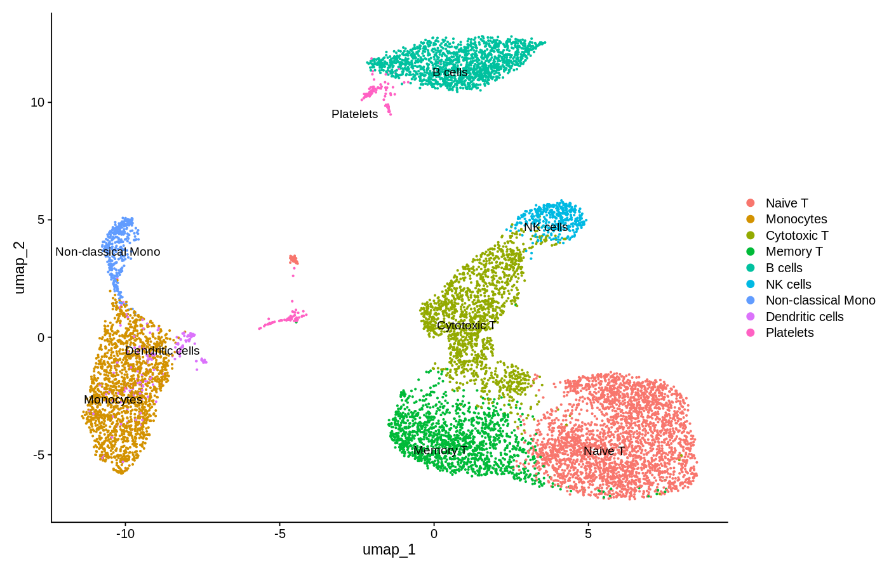

# scRNA-seq Pipeline: PBMC Cell Type Annotation

Single-cell RNA-seq analysis of 2,700 human PBMCs using Seurat.

## Results

### Annotated UMAP — 9 Cell Types Identified

9 distinct cell populations identified:
Naive T cells, Memory T cells, Cytotoxic T cells,
B cells, NK cells, Monocytes, Myeloid cells,
Dendritic cells, Platelets

## Pipeline
- Quality control and filtering (2,700 → 2,638 cells)
- Normalization and scaling
- PCA dimensionality reduction (10 PCs)
- Graph-based clustering (resolution 0.5)
- UMAP visualization
- Marker gene identification
- Cell type annotation

## Tools
R, Seurat, ggplot2, dplyr, Ubuntu, Git

## Exercise 1: Multi-Sample Integration

### The Problem — Batch Effect

> Two donors completely separated by technical variation
> not biological differences.

### The Solution — Harmony Integration  

> Donors now mixed within each cluster.
> Biological signal visible.

### Final Annotated UMAP — 9 Cell Types

> Cell types identified: Naive T, Memory T, Cytotoxic T,
> NK cells, B cells, Monocytes, Non-classical Monocytes,
> Dendritic cells, Platelets.
> Unknown cluster resolved as Naive T cells via
> CCR7 and LEF1 marker analysis.

## Key Skills Learned
- Batch effect detection and correction (Harmony)
- Multi-sample integration (Seurat v5 JoinLayers)
- Unknown cluster investigation
- Cross-dataset marker variability
