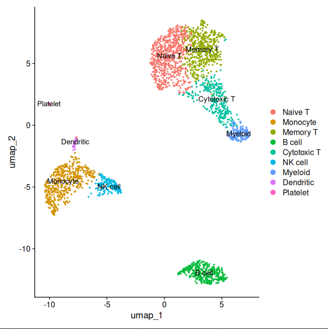

# scRNA-seq Pipeline: PBMC Cell Type Annotation

Single-cell RNA-seq analysis of 2,700 human PBMCs using Seurat.

## Results

### Annotated UMAP — 9 Cell Types Identified

9 distinct cell populations identified:
Naive T cells, Memory T cells, Cytotoxic T cells,
B cells, NK cells, Monocytes, Myeloid cells,
Dendritic cells, Platelets

## Pipeline
- Quality control and filtering (2,700 → 2,638 cells)
- Normalization and scaling
- PCA dimensionality reduction (10 PCs)
- Graph-based clustering (resolution 0.5)
- UMAP visualization
- Marker gene identification
- Cell type annotation

## Tools
R, Seurat, ggplot2, dplyr, Ubuntu, Git
